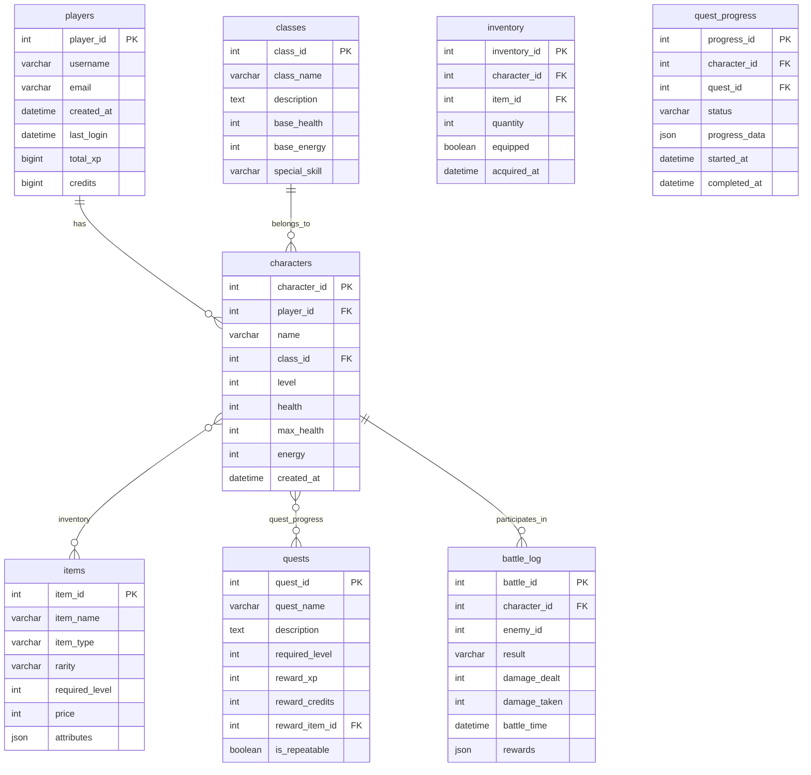

# CyberPunk-Quest-MMORPG-
🎮 План базы данных для игры: CyberPunk Quest (MMORPG в стиле киберпанк)

📊 Сущности (Основные таблицы)

1. players — Игроки
| Поле          | Тип данных     | Описание                      |
|---------------|----------------|-------------------------------|
| player_id     | INT PRIMARY KEY| Уникальный ID игрока          |
| username      | VARCHAR(50)    | Имя игрока                    |
| email         | VARCHAR(100)   | Email (уникальный)            |
| created_at    | DATETIME       | Дата регистрации              |
| last_login    | DATETIME       | Последний вход                |
| total_xp      | BIGINT         | Общий опыт                    |
| credits       | BIGINT         | Игровая валюта                |

2. characters — Персонажи
| Поле          | Тип данных     | Описание                      |
|---------------|----------------|-------------------------------|
| character_id  | INT PRIMARY KEY| Уникальный ID персонажа       |
| player_id     | INT            | ID владельца (FK → players)   |
| name          | VARCHAR(50)    | Имя персонажа                 |
| class_id      | INT            | Класс (FK → classes)          |
| level         | INT            | Уровень (1-100)               |
| health        | INT            | Текущее здоровье              |
| max_health    | INT            | Макс. здоровье                |
| energy        | INT            | Энергия (для способностей)    |
| created_at    | DATETIME       | Дата создания                 |

3. classes — Классы персонажей
| Поле          | Тип данных     | Описание                      |
|---------------|----------------|-------------------------------|
| class_id      | INT PRIMARY KEY| Уникальный ID класса          |
| class_name    | VARCHAR(30)    | Название класса               |
| description   | TEXT           | Описание класса               |
| base_health   | INT            | Базовое здоровье              |
| base_energy   | INT            | Базовая энергия               |
| special_skill | VARCHAR(50)    | Уникальная способность        |

4. items — Предметы
| Поле          | Тип данных     | Описание                      |
|---------------|----------------|-------------------------------|
| item_id       | INT PRIMARY KEY| Уникальный ID предмета        |
| item_name     | VARCHAR(100)   | Название предмета             |
| item_type     | VARCHAR(30)    | Тип (оружие, броня, зелье и т.д.)|
| rarity        | VARCHAR(20)    | Редкость (Common, Rare, Epic, Legendary)|
| required_level| INT            | Требуемый уровень             |
| price         | INT            | Базовая цена                  |
| attributes    | JSON           | Атрибуты предмета (урон, защита и т.д.)|

5. quests — Квесты
| Поле          | Тип данных     | Описание                      |
|---------------|----------------|-------------------------------|
| quest_id      | INT PRIMARY KEY| Уникальный ID квеста          |
| quest_name    | VARCHAR(100)   | Название квеста               |
| description   | TEXT           | Описание квеста               |
| required_level| INT            | Требуемый уровень             |
| reward_xp     | INT            | Награда: опыт                 |
| reward_credits| INT            | Награда: кредиты              |
| reward_item_id| INT            | Награда: предмет (FK → items) |
| is_repeatable | BOOLEAN        | Повторяемый ли                |

---

🔗 Связи между таблицами

```
1. players (1) — (много) characters (1:М)
   Один игрок может иметь несколько персонажей.

2. classes (1) — (много) characters (1:М)
   Один класс может быть у многих персонажей.

3. characters (М) — (много) items (М:М) → inventory (таблица связи)
   Персонаж может иметь много предметов, предмет может быть у многих персонажей.

4. characters (М) — (много) quests (М:М) → quest_progress (таблица связи)
   Персонаж может выполнять много квестов, квест может выполняться многими персонажами.

5. characters (1) — (много) battles (1:М) → battle_log (таблица связи)
   Персонаж участвует в боях (PvE/PvP).
```

---

📑 Таблицы взаимосвязей

1. inventory — Инвентарь (М:М связь characters ⇄ items)
| Поле           | Тип данных     | Описание                      |
|----------------|----------------|-------------------------------|
| inventory_id   | INT PRIMARY KEY| Уникальный ID записи          |
| character_id   | INT            | ID персонажа (FK → characters)|
| item_id        | INT            | ID предмета (FK → items)      |
| quantity       | INT            | Количество предметов          |
| equipped       | BOOLEAN        | Надет ли предмет              |
| acquired_at    | DATETIME       | Дата получения                |

2. quest_progress — Прогресс выполнения квестов (М:М связь characters ⇄ quests)
| Поле           | Тип данных     | Описание                      |
|----------------|----------------|-------------------------------|
| progress_id    | INT PRIMARY KEY| Уникальный ID прогресса       |
| character_id   | INT            | ID персонажа (FK → characters)|
| quest_id       | INT            | ID квеста (FK → quests)       |
| status         | VARCHAR(20)    | Статус (active, completed, failed)|
| progress_data  | JSON           | Данные прогресса (например, убито врагов: 5/10)|
| started_at     | DATETIME       | Дата начала квеста            |
| completed_at   | DATETIME       | Дата завершения (NULL если не завершён)|

3. battle_log — Лог боёв (М:М связь characters ⇄ battles)
| Поле           | Тип данных     | Описание                      |
|----------------|----------------|-------------------------------|
| battle_id      | INT PRIMARY KEY| Уникальный ID боя             |
| character_id   | INT            | ID персонажа (FK → characters)|
| enemy_id       | INT            | ID врага (NPC или другой игрок)|
| result         | VARCHAR(10)    | Результат (win, lose, draw)  |
| damage_dealt   | INT            | Нанесённый урон               |
| damage_taken   | INT            | Полученный урон               |
| battle_time    | DATETIME       | Время боя                     |
| rewards        | JSON           | Награды (xp, items)           |

---

📐 Диаграмма связей (Mermaid)



## 🎯 **Ключевые особенности плана базы данных**

1. Нормализация:
   Таблицы разделены логически, избегаем избыточности данных.

2. Гибкость:*
   Использование JSON-полей (`attributes`, `progress_data`, `rewards`) позволяет хранить динамические данные без изменения схемы.

3. Производительность: 
   Все основные таблицы имеют первичные ключи и индексы на внешних ключах.

4. Масштабируемость:
   Легко добавить новые таблицы (например, `guilds`, `skills`, `auction_house`).

5. Игровая логика:
   План учитывает основные механики MMORPG: инвентарь, квесты, бои, прокачка персонажа.

✅ **План готов к реализации в SQL (MySQL/PostgreSQL)**  
